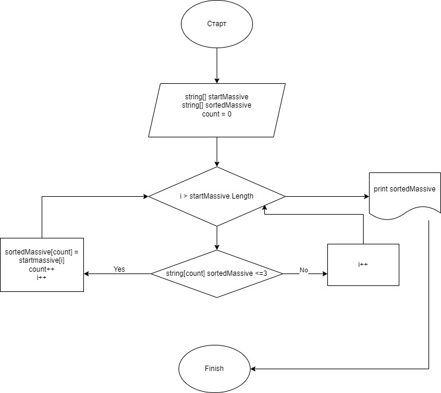

# Итоговый тест по первому блоку

## Формулировка задачи

Написать программу, которая из имеющегося массива строк формирует новый массив из строк, длина которых меньше, либо равна 3 символам. Первоначальный массив можно ввести с клавиатуры, либо задать на старте выполнения алгоритма. При решении не рекомендуется пользоваться коллекциями, лучше обойтись исключительно массивами.

Примеры: [“Hello”, “2”, “world”, “:-)”] → [“2”, “:-)”] 

[“1234”, “1567”, “-2”, “computer science”] → [“-2”] [“Russia”, 

“Denmark”, “Kazan”] → []

## Алгоритм решения итогового теста

1. Создаем репозиторий на GitHub

2. Нарисовать блок-схему алгоритма

3.  Снабдить репозиторий оформленным текстовым описанием решения (файл README.md)

4. Написать программу, решающую поставленную задачу

5. Использовать контроль версий в работе над этим небольшим проектом (не должно быть так, что всё залито одним коммитом, как минимум этапы 2, 3, и 4 должны быть расположены в разных коммитах)

## Блок-схема решения задачи

Перед тем как решить посьавленную задачку создаеь блоксхему

## Алгоритм решения задачи
1.  На первом этапе необходимо задать исходный массив строк.

2.  Далее создаем второй массив длинной равным заданному.

3. Третьем шагом задаем функцию, которая будет проверять  строки заданного массива строк и определять те , которые подходят под условие задачи

4. Четвертый этап - задаем функцию для вывода ответа массива в консоль.

